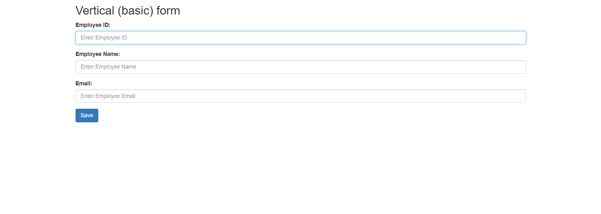
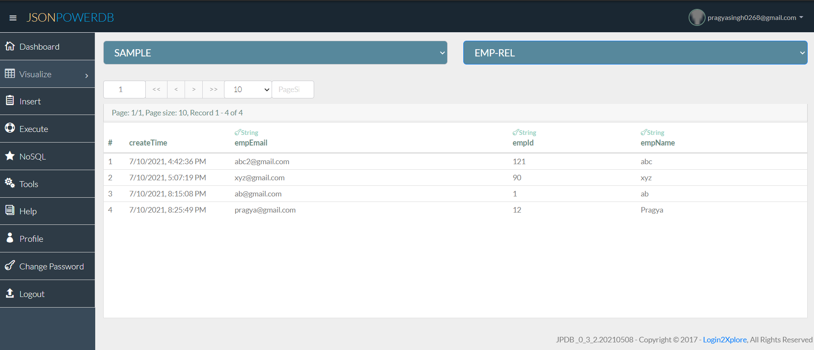

# Login2XploreCode

#### DESCRIPTION
This is an HTML form code used to eneter data. The data is stored and updated in JasonPowerDB. I've used HTML, JavaScript,XML, AJAX and the tool used is Apache NetBeans.

#### 
#### 

#### Benefits of using JasonPowerDB
* Minimum development cost
* Minimum complexity
* Maximum data processing 
* Technology futuristic 
* Minimum type for marketing

